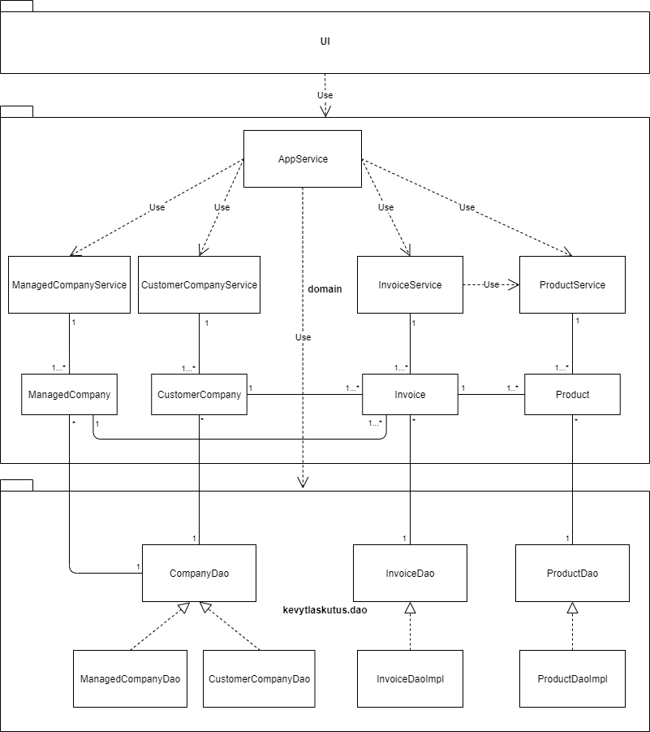

# Arkkitehtuurikuvaus 

## Rakenne

Ohjelman rakenne noudattelee kolmitasoista kerrosarkkitehtuuria, ja koodin pakkausrakenne on seuraava:

Pakkaukset:

- kevytlaskutus.ui: JavaFX-käyttöliittymä 
- kevytlaskutus.domain sovelluslogiikka 
- kevytlaskutus.dao tietojen tallennus

## Käyttöliittymä

Käyttöliittymä sisältää seuraavat näkymät:

- Yritysten hallintanäkymä, jossa käyttäjä voi hallita yrityksiensä tietoja
- Yritysten muokkaus- ja tallennusnäkymä
- Asiakkaiden hallintanäkymä, jossa käyttäjä voi hallita asiakkaidensa tietoja
- Asiakkaiden muokkaus- ja tallennusnäkymä
- Yrityksen laskujen hallintanäkymä, jossa käyttäjä voi hallita yrityksensä laskuja
- Laskujen muokkaus- ja tallennusnäkymä

Jokainen näkymä on toteutettu Scene-oliona, jonka asettelun pohjana on fmxl-malli. Näkymät sijoitetaan yksi kerrallaan sovelluksen Stageen, josta huolehtii käyttöliittymän ViewController-luokka. 

Jokaisella näkymällä on taas oma kontrollerinsa, kuten esimerkiksi ManageCustomerController asiakkaiden hallintanäkymälle ja EditCustomerController asiakastietojen muokkausnäkymälle. Näkymäkohtaiset kontrollerit perivät BaseController-luokan, joka sisältää mm. globaalin navigaation toiminnallisuudet. 

Käyttöliittymä on eriytetty kokonaan sovelluslogiikasta. Käyttöliittymä saa kaiken datan kutsumalla sovelluslogiikan luokan AppService metodeja ja se myös käyttää AppServicen metodeja käyttäjän syöttämän datan välittämiseksi sovelluslogiikan käsiteltäväksi.

Kun käyttäjä lisää onnistuneesti uuden yrityksen, asiakkaan tai laskun, kyseisen näkymän kontrolleri kutsuu ViewFactoryn soveltuvaa metodia, joka vaihtaaa näkymäksi yritysten, asiakkaiden tai laskujen hallintanäkymän. Koska jokainen näkymä piirretään uudelleen aina näkymää vaihdettaessa, käyttäjä näkee lisäämänsä tietueen heti hallintanäkymässä. Mikäli tietueen lisäys ei onnistu puuttuvista tiedoista johtuen, tästä ilmoitetaan käyttäjälle suoraan muokkausnäkymässä. 

Muokkausnäkymien lomakkeet rakennetaan kutsumalla näkymän kontrollerista Form-luokan metodeja, kuten addTextField, addDecimalField tai addDatePicker. Form-luokan metodit huolehtivat lomakkeiden kenttien rakentamisesta käyttäjän antamien parametrien avulla ja lisää kentät näkymään. 

Form-luokka hyödyntää lomakekenttien rakentamisessa FormField-rajapinnan toteuttavia luokkia, kuten FormFieldText- ja FormFieldDatePicker-luokkia. FormField-rajapinnan toteuttavilla luokilla on metodit, joiden avulla voidaan määritellä FormField-olioille tapahtumakuuntelijan ja ns. callBack-metodin dynaamisesti. Tapahtumakuuntelijoiden ja callBack-metodien kutsumat luokat ja metodien nimet välitetään parametreinä näille metodeille. 

- Muokkausnäkymien lomakkeiden kentät välittävät syötetyn datan välittömästi AppService-luokalle näiden tapahtumakuuntelijoiden avulla. 
- CallBack-metodien avulla kutsutaan pääasiassa käyttöliittymän luokkien metodeja näkymien tietojen päivittämiseksi. 

Kun käyttäjä klikkaa muokkausnäkymässä tallenna-nappia, kutsutaan FormActionFactory-luokan metodia execute, jolle välitetään String-tyyppisenä parametrina "actionType", joka voi olla esimerkiksi "SaveManagedCompany" tai "SaveCustomerCompany". Tämän parametrin perusteella FormActionFactoryn poimii ja suorittaa soveltuvan FormAction-luokan execute-metodin command-suunnittelumallin mukaisesti. 

FormAction-luokkien metodit kutsuvat puolestaan AppService-luokan parametrittomia metodeja saveCurrentManagedCompany tai saveCurrentCustomerCompany. Nämä tallentavat sovelluksen tilassa olevat ManagedCompany-, CustomerCompany, Product ja Invoice-oliot tietokantaan.

## Sovelluslogiikka

Toiminnallisista kokonaisuuksista vastaa luokka appService, joka hyödyntää myös luokkia productService, invoiceService, managedCompanyService ja customerCompanyService. AppService-luokka tarjoaa kaikille käyttöliittymän toiminnoille oman metodin. 

Näitä ovat esim.

- void setCurrentManagedCompany(ManagedCompany company) 
- ManagedCompany getCurrentManagedCompany()
- boolean saveCurrentManagedCompany()
- boolean updateCurrentManagedCompany()
- boolean deleteManagedCompany(int id)

ja vastaavat metodit myös Invoice ja CustomerCompany-olioille. Lisäksi luokka tarjoaa toiminnot:

- boolean hasNoticePending()
- Notice getPendingNotice() 

AppService pääsee käsiksi kaikkiin olioihin pakkauksen kevytlaskutus.dao luokkien kautta, jotka toteuttavat ManagedCompanyDao, CustomerCompanyDao, InvoiceDao ja ProductDao-rajapinnat. 

Kaikki riippuvuudet injektoidaan sovelluslogiikalle konstruktorikutsun yhteydessä.

Ohjelman osien suhdetta kuvaava luokka/pakkauskaavio:

 

### Tietojen pysyväistallennus

Pakkauksen kevytlaskutus.dao luokat ManagedCompanyDao, CustomerCompanyDao, InvoiceDaoImpl ja ProductDaoImpl huolehtivat tietojen tallentamisesta tietokantaan ja tietojen noutamisesta tietokannasta.

Pakkauksen Populate-luokka käsittelee sekä tietokannasta noudetut tiedot, että sinne tallennettavat tiedot. Kaikki tietokantatulokset toisaalta välitetään Populate-luokalle, joka tuottaa tiedoista olioita, ja toisaalta kaikki tallennettavat tiedot välitetään ensin Populate-luokalle, joka lisää tiedot PreparedStatement-olioon. 

Kaikki Dao-Luokat noudattavat Data Access Object -suunnittelumallia ja ne voidaan korvata uusilla toteutuksilla, jos tallennusmenetelmiä halutaan vaihtaa. Luokkien sisäinen logiikka on häivytetty rajapintojen taakse, jolloin sovelluslogiikkan käyttäjän ei tarvitse tietää niiden yksityiskohdista. 

Sovelluslogiikan testaus käyttää tietokantaa, joka on keskusmuistissa, kun taas itse sovellus tallentaa tietokannan käyttäjän laitteelle massamuistiin.

## Päätoiminnallisuudet

Alla oleva sekvenssikaavio kuvaa, miten sovelluksen kontrolli etenee kun käyttäjä lisää uuden hallittavan yrityksen.

Tapahtumakäsittelijä kutsuu AppService-luokan metodia saveCurrentManagedCompany ja AppService tarkistaa ensin, että sovelluksen tilassa on valittuna ManagedCompany-olio ja että tällä on vähintäänkin nimi. Jos nämä ovat kunnossa, AppService kutsuu ManagedCompanyService-luokan metodia createManagedCompany, lähettäen parametrina nykyisen ManagedCompany-olion. 

ManagedCompanyService kutsuu puolestaan ManagedCompanyDao-luokan metodia create ja välittää ManagedCompany-olion edelleen parametrina. ManagedCompanyDao-luokka tallentaa tiedot tietokantaan ja palauttaa true, jos operaatio onnistuu ja false, jos se epäonnistuu.

Jos operaatio onnistuu, ManagedCompanyDao palauttaa true ManagedCompanyServicelle, joka välittää vastauksen eteen päin AppService-luokalle. Tämän jälkeen appService lisää notifikaation NoticeQueue-jonoon. Lisättävässä Notice-oliossa on indikaattori onnistuneesta operaatiosta ja viesti käyttäjälle. Indikaattoreiden true ja false avulla määritellään, onko kyseessä NoticeSuccess- vai NoticeError-luokka. 

Tämän jälkeen AppService välittää tiedon operaation onnistumisesta tai epäonnistumisesta käyttöliittymälle, joka onnistumisen yhteydessä siirtää käyttäjän dashboard-näkymään. Dashboard puolestaan kysyy välittömästi AppService-luokalta, onko NoticeQueue-jonossa uusia ilmoituksia ja jos on, se pyytää ensimmäisenä jonossa olevan Notice-olion tältä ja esittää sen käyttäjälle.

### Muut toiminnallisuudet

Sama periaate toistuu myös tallennettaessa ja päivitettäessä ManagedCompany, CustomerCompany ja Invoice-olioita. 