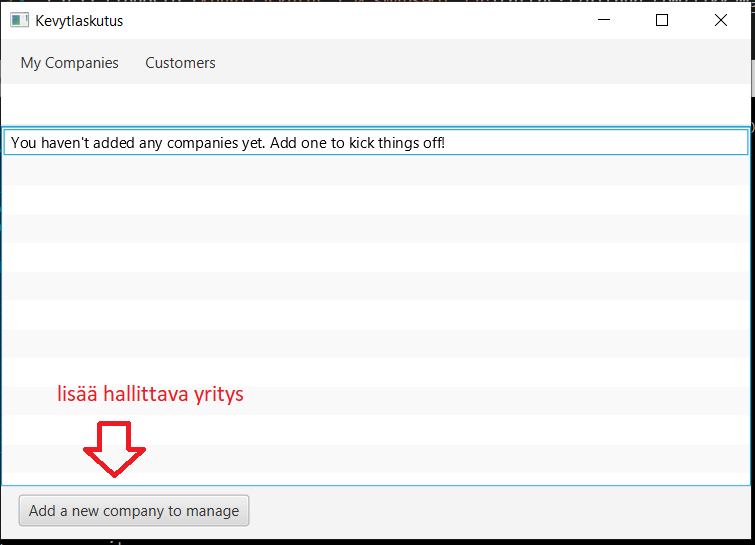
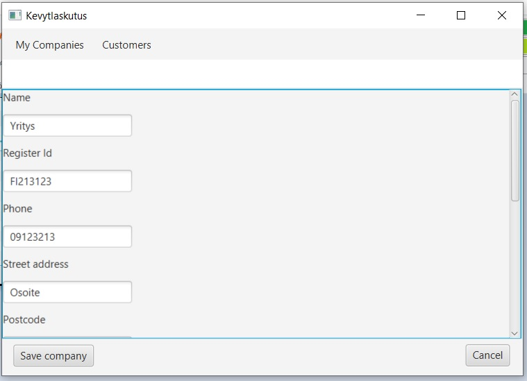
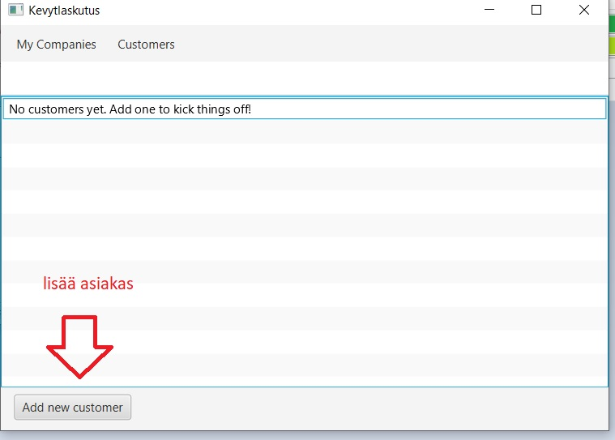
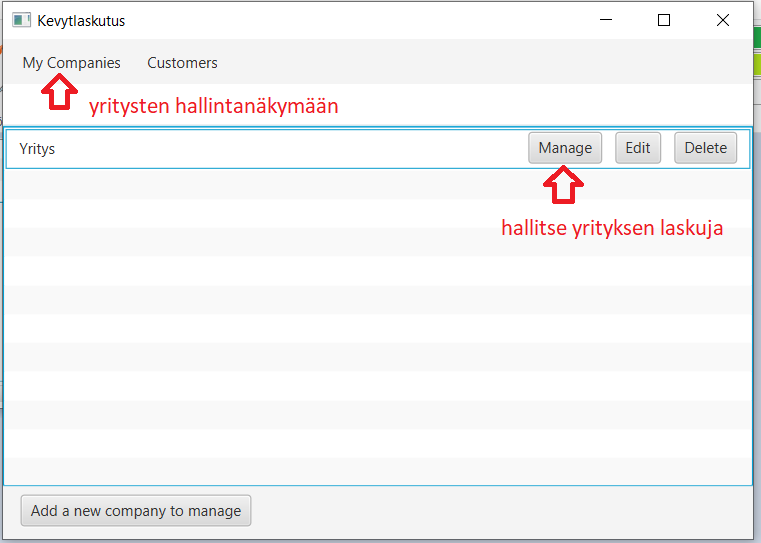
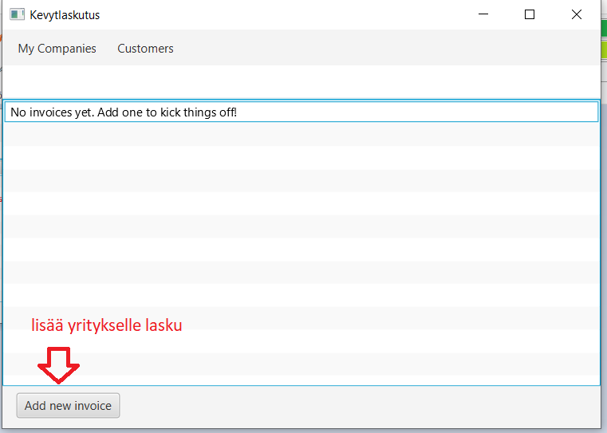
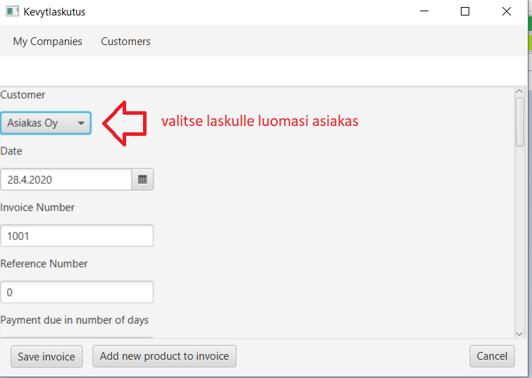

# Käyttöohje

Lataa tiedosto [Kevytlaskutus-1.0-SNAPSHOT.jar](https://github.com/ilkkamaksy/ot-harjoitustyo/releases/download/viikko6/Kevytlaskutus-1.0-SNAPSHOT.jar)

## Ohjelman käynnistäminen

Ohjelma käynnistyy komennolla

```
java -jar Kevytlaskutus-1.0-SNAPSHOT.jar
```

## Hallinta

Luo uusi hallittava yritys avautuvassa näkymässä My Companies:



Lisää yritykselle perustiedot ja tallenna:



Lisää tämän jälkeen asiakas, jolle luomasi yritys voi lisätä laskuja:



Lisää asiakkaalle tiedot ja tallenna:


Siirry sitten näkymään My Companies ja klikkaa sen yrityksen kohdalla "manage", jolle haluat lisätä uuden laskun:



Lisää uusi lasku:



Lisää laskulle asiakas ja tarvittavat tiedot. Minimivaatimuksena on asiakas ja kaikille tuotteille tulee antaa vähintään nimi:

