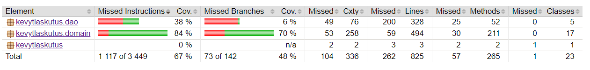

# Testausdokumentti

Ohjelmaa on testattu sekä yksikkötestein, että integraatiotestein JUnitilla. Lisäksi järjestelmätestaus on suoritettu manuaalisesti. 

## Yksikkö- ja integraatiotestaus

### DAO-luokat

DAO-luokkia testataan hyödyntämällä muistiin tallennettua tietokantaa. 

### Testauskattavuus

Käyttöliittymäkerrosta lukuunottamatta sovelluksen testauksen rivikattavuus on 67% ja haarautumakattavuus 48%. Toistaiseksi tuntemattomasta syystä jacoco ei poimi kaikkia DAO-luokkien testejä kattavuusraporttiin.

## Järjestelmätestaus

Sovelluksen järjestelmätestaus suoritetaan manuaalisesti. 

## Asennus ja konfigurointi

Sovellus on haettu ja sitä on testattu sekä Windows- että Linux-ympäristössä. 

## Toiminnallisuudet

Kaikki määrittelydokumentissa ja käyttöohjeessa käsitellyt toiminnallisuudet testataan. 