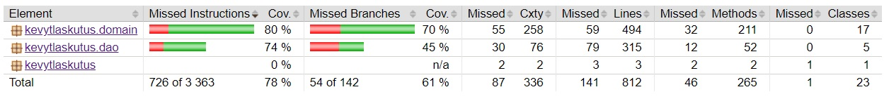

# Testausdokumentti

Ohjelmaa on testattu sekä yksikkötestein, että integraatiotestein JUnitilla. Lisäksi järjestelmätestaus on suoritettu manuaalisesti. 

## Yksikkö- ja integraatiotestaus

### DAO-luokat

DAO-luokkia testataan hyödyntämällä muistiin tallennettua tietokantaa. 

### Sovelluslogiikan testaus

Pakkauksessa kevytlaskutus.domain sijaitsevia sovelluslogiikan keskeisiä luokkia testataan sekä integraatio-, että yksikkötestein. Keskeiset sovelluslogiikan testit ovat luokissa AppServiceTest, CustomerCompanyServiceTest, InvoiceServiceTest, ManagedCompanyServiceTest ja ProductServiceTest. Luokkien sisältämissä integraatiotesteissä DAO-luokkia simuloidaan mock-olioilla. 

Sovelluslogiikan luokista testataan lisäksi InvoiceTotalTest ja ReferenceNumberTest yksikkötestein. Lisäksi InvoiceTest -luokka testaa yksikkötestein Invoice-luokan toimintaa.

### Testauskattavuus

Käyttöliittymäkerrosta lukuunottamatta sovelluksen testauksen rivikattavuus on 78% ja haarautumakattavuus 61%. 

## Järjestelmätestaus

Sovelluksen järjestelmätestaus suoritetaan manuaalisesti. 

## Asennus ja konfigurointi

Sovellusta on suoritettu ja testattu sekä Windows- että Linux-ympäristössä. 

## Toiminnallisuudet

Kaikki määrittelydokumentissa ja käyttöohjeessa käsitellyt toiminnallisuudet on testattu. 