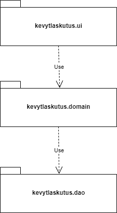
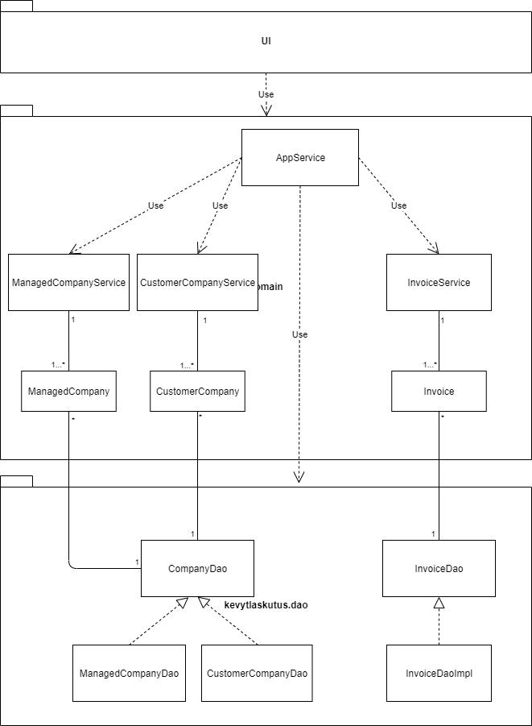
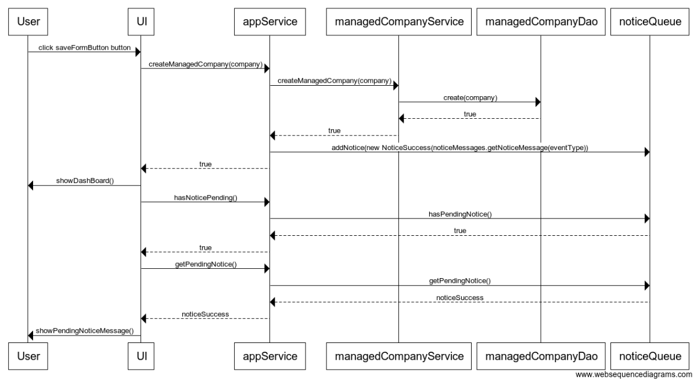

# Arkkitehtuurikuvaus 

## Rakenne

Ohjelman rakenne noudattelee kolmitasoista kerrosarkkitehtuuria, ja koodin pakkausrakenne on seuraava:

Pakkaukset:

- kevytlaskutus.ui: JavaFX-käyttöliittymä 
- kevytlaskutus.domain sovelluslogiikka 
- kevytlaskutus.dao tietojen tallennus

## Luokka/pakkauskaavio:

 Ohjelman osien suhdetta kuvaava luokka/pakkauskaavio:

 

## Päätoiminnallisuudet

Alla oleva sekvenssikaavio kuvaa, miten sovelluksen kontrolli etenee kun käyttäjä lisää uuden hallittavan yrityksen.

