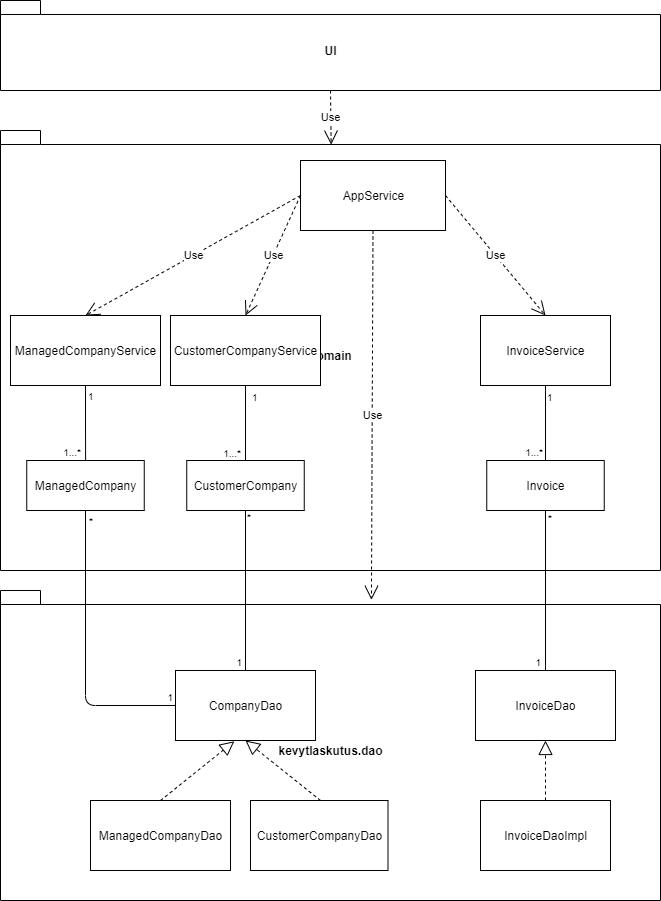
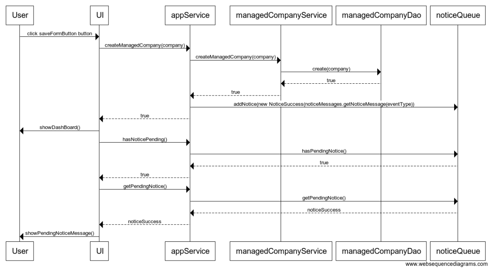

# Arkkitehtuurikuvaus 

## Rakenne

Ohjelman rakenne noudattelee kolmitasoista kerrosarkkitehtuuria, ja koodin pakkausrakenne on seuraava:

Pakkaukset:

- kevytlaskutus.ui: JavaFX-käyttöliittymä 
- kevytlaskutus.domain sovelluslogiikka 
- kevytlaskutus.dao tietojen tallennus

## Sovelluslogiikka

Toiminnallisista kokonaisuuksista vastaa luokka appService, joka hyödyntää myös luokkia productService, invoiceService, managedCompanyService ja customerCompanyService. AppService-luokka tarjoaa kaikille käyttöliittymän toiminnoille oman metodin. 

Näitä ovat esim.

- void setCurrentManagedCompany(ManagedCompany company) 
- ManagedCompany getCurrentManagedCompany()
- boolean saveCurrentManagedCompany()
- boolean updateCurrentManagedCompany()
- boolean deleteManagedCompany(int id)

ja vastaavat metodit myös muille Invoice ja CustomerCompany-olioille. Lisäksi luokka tarjoaa toiminnot:

- boolean hasNoticePending()
- Notice getPendingNotice() 

AppService pääsee käsiksi kaikkiin olioihin pakkauksen kevytlaskutus.dao luokkien kautta, jotka toteuttavat ManagedCompanyDao, CustomerCompanyDao, InvoiceDao ja ProductDao-rajapinnat. 

Kaikki riippuvuudet injektoidaan sovelluslogiikalle konstruktorikutsun yhteydessä.

Ohjelman osien suhdetta kuvaava luokka/pakkauskaavio:

 

### Tietojen pysyväistallennus

Pakkauksen kevytlaskutus.dao luokat ManagedCompanyDao, CustomerCompanyDao, InvoiceDaoImpl ja ProductDaoImpl huolehtivat tietojen tallentamisesta tietokantaan ja tietojen noutamisesta tietokannasta.

Pakkauksen Populate-luokka käsittelee sekä tietokannasta noudetut tiedot, että sinne tallennettavat tiedot. Kaikki tietokantatulokset toisaalta välitetään Populate-luokalle, joka tuottaa tiedoista olioita, ja toisaalta kaikki tallennettavat tiedot välitetään ensin Populate-luokalle, joka lisää tiedot PreparedStatement-olioon. 

Kaikki Dao-Luokat noudattavat Data Access Object -suunnittelumallia ja ne voidaan korvata uusilla toteutuksilla, jos tallennusmenetelmiä halutaan vaihtaa. Luokkien sisäinen logiikka on häivytetty rajapintojen taakse, jolloin sovelluslogiikkan käyttäjän ei tarvitse tietää niiden yksityiskohdista. 

Sovelluslogiikan testaus käyttää tietokantaa, joka on keskusmuistissa, kun taas itse sovellus tallentaa tietokannan käyttäjän laitteelle massamuistiin.

## Päätoiminnallisuudet

Alla oleva sekvenssikaavio kuvaa, miten sovelluksen kontrolli etenee kun käyttäjä lisää uuden hallittavan yrityksen.

